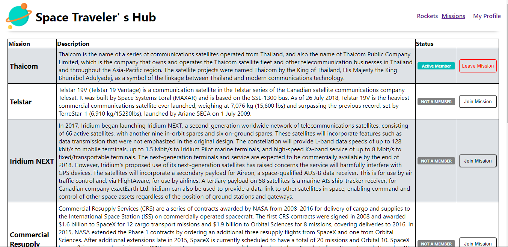
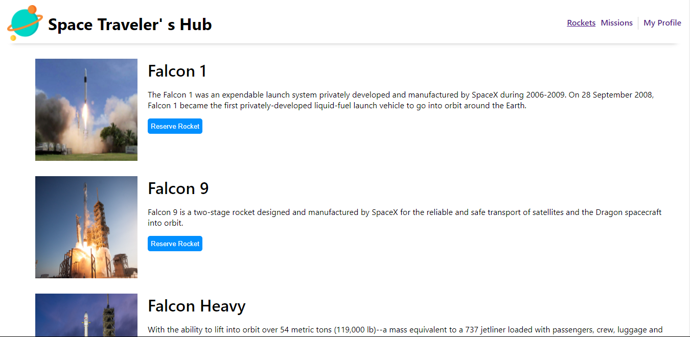
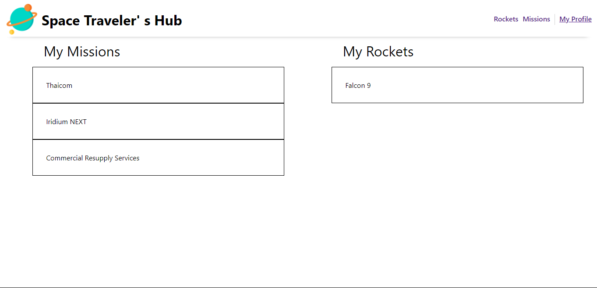

# Space Traveler's Hub

> Space Travel





The application will allow users to book rockets and join selected space missions.

## Built With

- React

## Live Demo

[Live Demo Link](https://bavon-emmanuel-space-hub.herokuapp.com/missions)

## Getting Started

To get a local copy up and running follow these simple example steps.

### Prerequisites

A Web Browser (preferably Google Chrome)

### Setup

- Clone the GitHub Repository
- Go to the Project Directory
- Run ```npm install```
- Run ```npm run build``` to build the project

### Usage

- Run ```npm run start``` to start the live server

## Authors

👤 **Author 1**

- GitHub: [@Bavon101](https://github.com/Bavon101)
- LinkedIn: [LinkedIn](https://www.linkedin.com/in/akumu-bavon-335416193/)

👤 **Author 2**

- GitHub: [Emmanuel Jolugbo](https://github.com/Thermiee)


## 🤝 Contributing

Contributions, issues, and feature requests are welcome!

Feel free to check the [issues page](../../issues/).

## Show your support

Give a ⭐️ if you like this project!

## Acknowledgments

- Microverse

## 📝 License

This project is [MIT](./LICENSE) licensed.